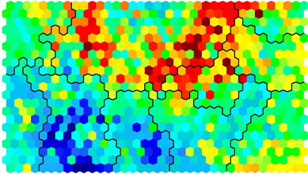

```{r setup, include=FALSE}
knitr::opts_chunk$set(echo = FALSE)
```
## Topics of the day
- Principal component analysis (PCA)
    + linear PCA 
    + Kernel PCA
- Clustering 
    + K-means
    + DBSCAN
    + Self-organizing map
- Case study: wine dataset


## Principal component analysis
* PCA is a linear transformation that projects data space to a new coordinate
* New axes are determined so that variability of data along the axis is largest
```{r,out.height = 300,fig.retina = NULL,fig.align='center'}

```

## PCA: 2D example
```{r,echo = TRUE}
x = rnorm(100,mean=0,sd=10)
y = 2*x+rnorm(100,mean=0,sd = 2)
plot(x,y)
```

## PCA: 2D example
```{r, echo=1:3}
data <- cbind(x,y)
datan <- scale(data)
PC <- prcomp(datan)
par(mfrow=c(1,2))
plot(datan)
abline(0,PC$rotation["y",1]/PC$rotation["x",1], col="red")
abline(0,PC$rotation["y",2]/PC$rotation["x",2], col="blue")
screeplot(PC,col=c("red","blue"))
```

## PCA: 2D example
```{r}
inputPanel(
  sliderInput("noise", label = "noise",
              min = 2, max = 50, value = 2, step = 2)
)
renderPlot({
  exdata <- cbind(x,2*x+rnorm(100,mean=0,sd = input$noise))
  exdata <- scale(exdata)
  PC <- prcomp(exdata,center = TRUE)
  par(mfrow=c(1,2))
  plot(exdata)
  abline(0,PC$rotation[2,1]/PC$rotation[1,1], col="red")
  abline(0,PC$rotation[2,2]/PC$rotation[1,2], col="blue")
  screeplot(PC,col=c("red","blue"))  
})

```

## PCA: example with higher dimension
```{r,echo=TRUE}
data(iris)
summary(iris)
dm <- iris[,-5]
```

## PCA: example with higher dimension
```{r}
pc_iris <- prcomp(dm,scale=TRUE)
summary(pc_iris)
plot(pc_iris,type="l")
```


## Other 2D examples
```{r,echo=FALSE}
theta = runif(200,0,360)
r = 20 + rnorm(200,mean=0,sd = 2)
x = r*cos(theta)
y = r*sin(theta)
plot(x,y,asp=1)
```
What is an effective dimensionality?

## Kernel PCA
```{r,out.height = 210,fig.retina = NULL,fig.align='center'}

```

## Difference between linear and kernel PCA
* PCs of linear PCA are eigenvector of a covariance matrix:
$\frac{1}{N-1} X^{T}X$
* PCs of kernel PCA are eigenvector of a Gram matrix: $\phi(X)\phi(X)^T = K(x_i,x_j)$
* In kernel PCA, both the transformation $\phi$ and PCs are implicit: we only know projection of data points to PCs!

## Kernel PCA: example
```{r}
library(mlbench)
spr<-mlbench.spirals(300,1.5,0.05)
plot(spr)
```

## PCA with the RBF kernel
```{r,warning=FALSE}
library(kernlab)
inputPanel(
  sliderInput("sigma", label = "RBF_sigma",
              min = 0, max = 50, value = 1, step = 1)
)
renderPlot({
   pc_spr <- kpca(spr$x,kernel = "rbfdot",kpar=list(sigma = input$sigma))
   plot(pc_spr@rotated[,1],pc_spr@rotated[,2],col=spr$classes)
})
```

## Clustering: what, and why?

* Divide data points into grous
* Often **unsupervised** (we don't know the existence of clusters)
* Useful in data exploration or compressing information (e.g.subgrouping)

## Clustering and Biology
```{r, out.height = 500, fig.retina = NULL,fig.align='center'}

```

## K-means clustering
1. Randomly divide data points into K clusters
2. Reassign each point to the nearest cluster based on the distance* to cluster centroids
3. Update cluster centroid after reassignment of cluster membership

\* distance metrics: Euclidean, Manhattan, ...

## K-means clustering: example
```{r,warning = FALSE}
data(iris)
dat <- iris[,1:2]
ctrs <- dat[c(1,3,5),]
iter2 <- kmeans(dat,ctrs,iter.max=1)
iter3 <- kmeans(dat,iter2$centers,iter.max=1)
centers <- cbind(ctrs,iter2$centers,iter3$centers)
colormat <- cbind(rep(1,150),iter2$cluster,iter3$cluster)
inputPanel(
  selectInput("iter", label = "Iteration",choices = 1:3)
)
renderPlot({
  idx <- as.numeric(input$iter)
  plot.new()
  plot(dat,col=colormat[,idx])
  points(centers[,(2*idx-1):(2*idx)],col=1:5,pch=8,cex=3,lwd=3)
})
```

## K-means clustering: problems?
>* Sensitive to initial cluster assignment
>* Have to specify K (number of clusters) *a priori*
>* Works best for spherical clusters

## DBSCAN
* **D**ensity-**B**ased **S**patial **C**lustering and **A**pplication with **N**oise
* Instances are clustered based on local difference in density 
* Points are classified into:
  + Core points: at least **minPts** points within a distance **eps**
  + Border points: in the neighborhood of core points
  + Outliers: not reachable from any other points
```{r, fig.retina = NULL,fig.align='center'}
knitr::include_graphics("DBSCAN.png")
```

## Example
```{r, echo=TRUE,warning = FALSE,message=FALSE}
library(factoextra)
df <- multishapes[, 1:2]
plot(df) 
```

## Example: K-means
```{r, echo=TRUE}
set.seed(123)
km <- kmeans(df, 5, nstart = 25)
plot(df,col=km$cluster)
```

## Example: DBSCAN
```{r}
library(fpc)
inputPanel(
  sliderInput("eps", label = "eps",
              min = 0.01, max = 0.3, value = 0.15, step = 0.01)
)
renderPlot({
   db <- fpc::dbscan(df, eps = input$eps, MinPts = 5)
   plot(db, df, main = "DBSCAN", frame = FALSE)
})
```

## How to find the best eps?
Calculate the average of the distances of every point to its MinPts nearest neighbors, and plot the distances in ascending order
```{r,warning = FALSE, message = FALSE}
library(dbscan)
dbscan::kNNdistplot(df, k =  5)
abline(h = 0.15, lty = 2)
```

## Self-organizing map (SOM)
- Project data into "nodes" arranged in a 2D surface 
- Each node is represented by a weight vector of input variables
- Each instance is mapped to one of the nodes
- Cool for visualization (just like PCA)
- Unlike PCA, do not assume linear relationship & no loss of information
```{r, fig.retina = NULL,fig.align='center'}

```

## SOM: learning algorithm
Learning is online (instance-by-instance)

>* Initialize nodes by giving random weight vectors
>* Choose a random data point and find the most similar node (BMU)
>* Adjust the weights of BMU and its neighboring nodes towards the chosen datapoint
>* repeat steps 2-4

## SOM example: Dublin census data
```{r,echo=TRUE,message=FALSE}
library(kohonen)
dublin <- read.csv("dublin.csv")
dublin_train <- dublin[, c(3,5,6,9)]
str(dublin_train)
```

## SOM example: Dublin census data
```{r,echo=TRUE}
# now train the SOM using the Kohonen method
dublin_matrix <- as.matrix(scale(dublin_train))
names(dublin_matrix) <- names(dublin_train)
som_grid <- somgrid(xdim = 10, ydim=10, topo="hexagonal") 
som_model <- som(dublin_matrix,grid=som_grid,rlen=100, 
                 alpha=c(0.05,0.01),n.hood="circular",
                 keep.data=TRUE)
```

## SOM example: Dublin census data
```{r}
plot(som_model, type = "codes") # weight vectors
```

## SOM example: Dublin census data
```{r}
par(mfrow=c(1,2))
plot(som_model, type = "property",property = som_model$codes[,3],main="avr_education_level")
plot(som_model, type = "property",property = som_model$codes[,4],main="unemployment_percent")
```


## References
- Y. Zhao, R and Data Mining: Examples and Case Studies


- http://www.sthda.com/english/wiki/dbscan-density-based-clustering-for-discovering-clusters-in-large-datasets-with-noise-unsupervised-machine-learning

